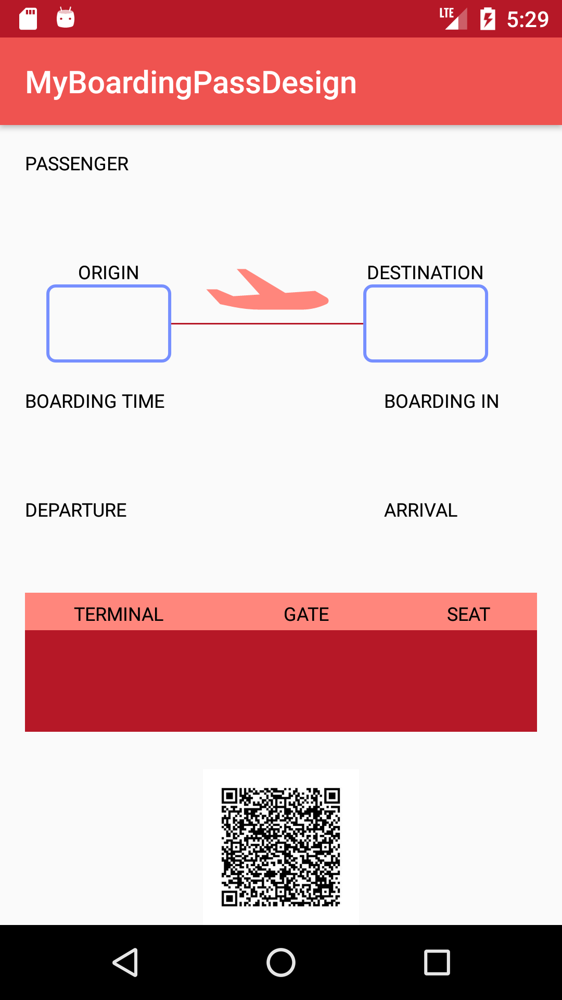
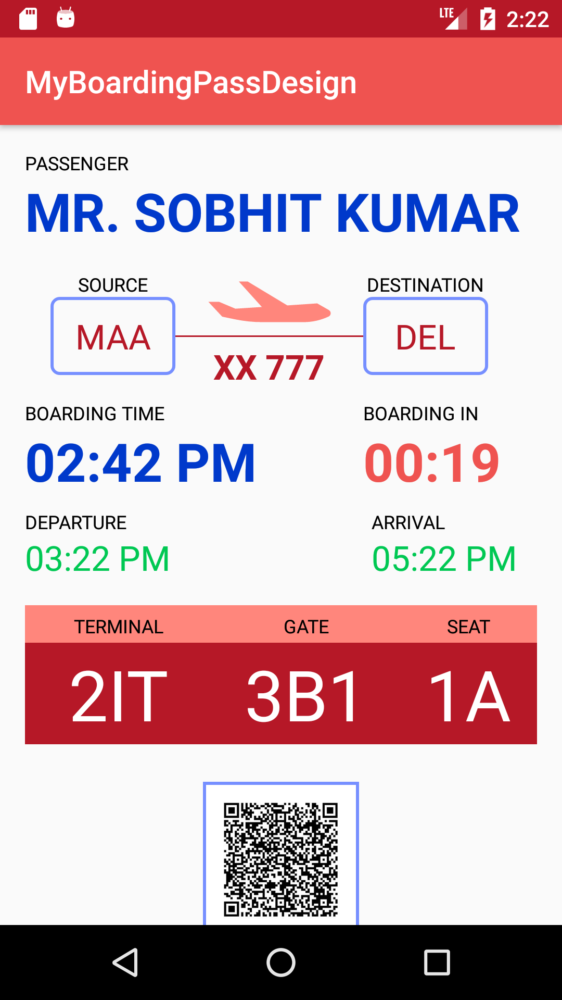
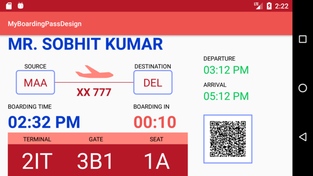
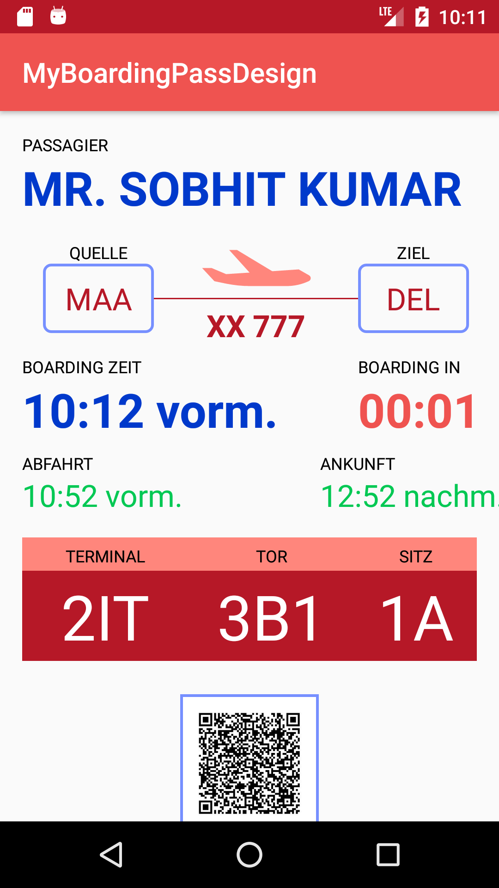

# Boarding Pass Design

This is a **Demo app** which I made during Taking *Udacity course Ud851.*


---

# Data Binding

  **Android Studio 1.3** and later provides support for data binding 

**The Data Binding Library** offers both **flexibility and broad compatibility** — it's a support library, so you can use it with all **Android platform versions** back to **Android 2.1 (API level 7+).** 

```
Data Binding Library to write declarative layouts and minimize the glue code necessary to bind
your application logic and layouts.
```

>   **Data Binding Library can help us link any UI with Actual Data.**  

**In this App , Data Binding is used to bind Fake Data with Views which can be replaced with actual data.**

|               Before  Data-binding               |               After  Data-binding               |
| :------------------------------------: | :------------------------------------: |
|  |  |

---


## Accessibility

```
Accessibility refers to the design of products, devices, services, or environments for people who 
experience disabilities.
```

**Some of the Accessibility feature provide by Android :**
- TalkBack
- Explore by touch
- Accessibility settings

##### In this app Accessiblity is added for for Source and Destination Airport 

**So, If you on Talk Back from your phone setting and click on the codes for source and Destination instead of Code it tells you Actual name of the airport.**

---


## Responsive UI

```
Responsive UI is an approach to Android App Development which makes your App render well on different
orientations(Portrait and Landscape) a variety of devices of Different Pixel density and  screen sizes.
```

**This app supports for Both portrait and landscape Orientations**

> 

---


##  Internationalization and Localization 

```
 internationalization and localization are means of adapting computer software to different languages,
 regional differences and technical requirements of a target locale.
```

**In this Application localization for french and german language Supported:**

|               For French               |               For German               |
| :------------------------------------: | :------------------------------------: |
|  |  |


